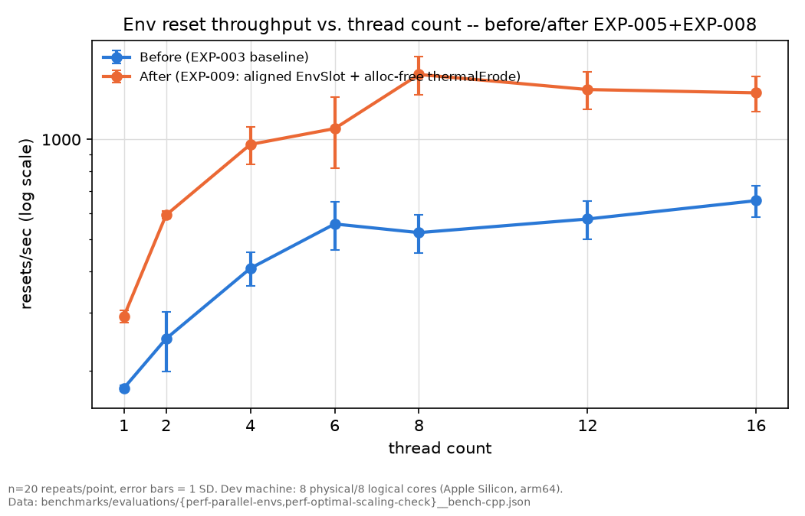
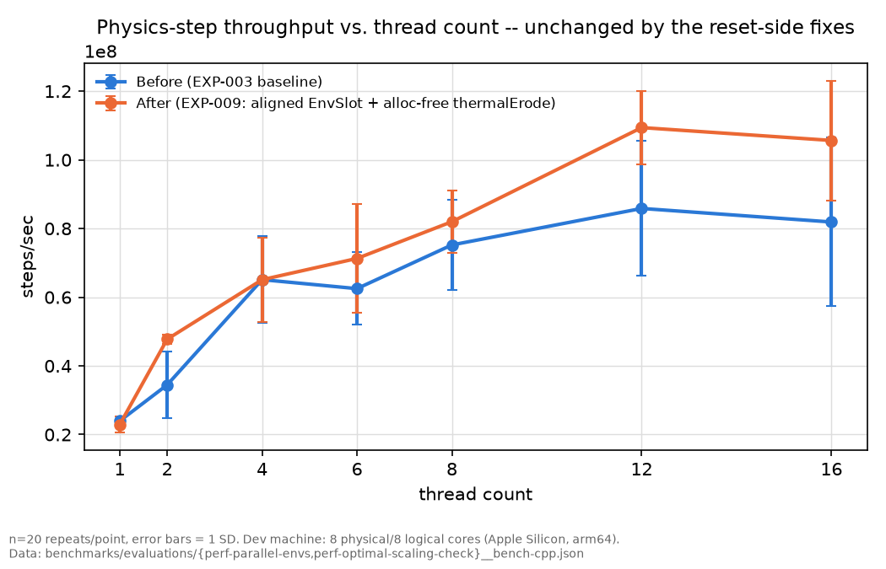

# 성능 엔지니어링: env reset/step 처리량 스케일링

Phase 2c의 성능 계측·병렬화 작업 전체를 정리한 문서다. 실험 하나하나의 상세 기록(가설, 통제변수, 원시 데이터)은 `benchmarks/experiments/perf-*.md`에 있고, 여기서는 그 전체 흐름과 최종 결론만 정리한다.

## 배경

Phase 2b 파이프라인(C++ physics → pybind11 → Gymnasium → PPO)이 완성된 뒤, `training/env.py`의 `TerrainAgentEnv.reset()`/`step()`을 각각 측정해보니 `reset()`이 `step()`보다 약 870배 비쌌다(`perf-stack-baseline__bench-{cpp,python}.json`). 실제 D20 평가의 평균 episode 길이(462 step)로 환산하면 episode당 env 쪽 wall-clock의 약 65%가 reset 한 번에 쓰이고 있었다 — RL rollout 처리량의 실제 병목은 물리 스텝이 아니라 지형 재생성이라는 뜻이었다.

## 접근 방법

이 프로젝트의 "측정 먼저" 원칙을 그대로 적용했다: 매 실험을 가설·독립변수·통제변수·사전 채택 기준을 먼저 적어(`benchmarks/experiments/`) 등록한 뒤에만 코드를 바꿨다. 이 과정에서 판단 기준 자체도 한 번 바뀌었다 — 처음엔 "+30% 이상 개선" 같은 라운드 넘버 임계값을 썼는데, 반복 측정 횟수(`n=7`)가 부족해 실제 신호를 노이즈로 착각한 사례(EXP-007 최초 실행)를 겪은 뒤 반복 횟수를 늘리고(`n=20`), 평균·표준편차 기반의 `t = Δ/SE_diff` 검정(`docs/evaluation-protocol.md` §18)으로 전환했다.

## 실험 요약

| 실험 | 독립변수 | 결과 |
|---|---|---|
| [`perf-parallel-envs`](../benchmarks/experiments/perf-parallel-envs.md) | 스레드 생성 방식(매 호출 spawn → 영속 풀) | 스레드 생성 오버헤드는 해결, 그러나 8-thread에서 4배 목표 미달 (`Inconclusive`) |
| [`perf-perlin-table-reuse`](../benchmarks/experiments/perf-perlin-table-reuse.md) | `PerlinNoise` 테이블 할당 정책(매 reset 재할당 → 재사용) | `Rejected` — 오히려 처리량 악화 (구조체 크기 변경으로 인한 교란) |
| [`perf-envslot-cache-align`](../benchmarks/experiments/perf-envslot-cache-align.md) | `EnvSlot` 캐시 라인 정렬 | resets/sec `Accepted`(+21.7%), steps/sec 무효과 |
| [`perf-perlin-reuse-aligned`](../benchmarks/experiments/perf-perlin-reuse-aligned.md) | 레이아웃 통제 후 `PerlinNoise` 재사용 재검증 | 통계적으로 무효과 — 애초에 할당 경합이 병목이 아니었음을 재확인 |
| [`perf-thermal-erode-bandwidth`](../benchmarks/experiments/perf-thermal-erode-bandwidth.md) | `thermalErode` 유무(같은 reset 워크로드) | `n=20` 재측정 후 `Accepted` — 물리 코어 수 근방에서 실제 대역폭 병목 확인 |
| [`perf-thermal-erode-alloc`](../benchmarks/experiments/perf-thermal-erode-alloc.md) | `thermalErode`의 셀당 힙 할당 제거 | `Accepted`, 압도적(물리 코어 8개에서 +196%) — 이 계열 전체에서 가장 큰 개선 |
| [`perf-optimal-scaling-check`](../benchmarks/experiments/perf-optimal-scaling-check.md) | (새 변수 없음) 채택된 개선을 합친 최종 확인 | resets/sec `Accepted`(5.33x, 원래 목표 초과 달성), steps/sec는 하드웨어 한계로 결론 |

## 결과

reset 처리량은 thread_count=1에서 8까지 **before 2.95배 → after 5.33배**로 스케일링 자체가 다른 체급이 됐다. 정렬(EXP-005)과 힙 할당 제거(EXP-008)를 합친 효과다.

step 처리량은 이 실험 계열 내내(EXP-003의 3.14배부터 이번 3.44배까지) 거의 그대로다 — `stepRigidBody`는 `thermalErode`를 호출하지 않으므로 이번 개선의 영향을 받을 이유가 없고, 실제로 어떤 개입(스레드 풀 재사용, 캐시 정렬, 할당 제거)도 이 숫자를 못 움직였다.

*(plot 생성: `benchmarks/plots/generate_perf_plots.py`, `benchmarks/evaluations/{perf-parallel-envs,perf-optimal-scaling-check}__bench-cpp.json`에서 재생성 가능, 원본 SVG는 같은 디렉터리)*

## 결론

1. **실제 병목은 스레드 확장성이 아니라 알고리즘 코드의 자원 수명 문제였다.** `thermalErode`의 `findLowestNeighbor`가 셀 하나·iteration 한 번마다 `std::vector`를 힙에 할당하고 있었다(reset 1회당 40,960번). 스레드 풀 재사용이나 캐시 라인 정렬보다 이 문제 하나를 고친 효과가 압도적으로 컸다 — 성능 문제를 "병렬화가 부족해서"로 성급히 결론짓지 않고 코드 리뷰까지 내려간 것이 결정적이었다.
2. **캐시 라인 정렬은 부차적이지만 실제 통계적으로 유의한 추가 개선**이었다(resets/sec +21.7%) — `EnvSlot`이 정확히 캐시 라인 크기(64바이트)였지만 정렬 요구사항이 없어 슬롯 간 false sharing이 있었다.
3. **`PerlinNoise` 테이블 재사용은 두 번(레이아웃 교란 있는 상태/없는 상태) 테스트했지만 둘 다 유의미한 효과가 없었다** — 힙 할당 크기가 크더라도 "reset당 1회"처럼 빈도가 낮으면 실제 병목이 아닐 수 있다는 반례로 기록해둔다.
4. **`stepRigidBody`의 8스레드 확장 한계(~3.5배)는 이 실험 계열의 어떤 개입으로도 움직이지 않았다** — 다만 이를 개발 머신의 병렬성 천장으로 결론지은 것은 2026-08-31에 철회한다. 같은 스윕(EXP-009)에서 12스레드 4.77배·16스레드 4.61배가 나오므로 하드웨어 상한일 수 없다. 남은 유력 가설은 하네스 구조다: 스레드당 env 1개를 고정 배정하고 barrier로 동기화하므로 phase 시간은 가장 느린 스레드가 결정하고, 4P+4E 코어에서 8스레드를 돌리면 E-core에 앉은 스레드가 꼬리가 된다. env를 스레드보다 많이 두고 동적으로 분배하는 실험으로 검증할 수 있으며, 검증 전까지 원인 미확정으로 둔다.

## 관련 문서

- 실험 상세 기록과 원시 데이터: `benchmarks/experiments/perf-*.md`, `benchmarks/evaluations/perf-*.json`
- 통계적 판단 기준: [`docs/evaluation-protocol.md`](evaluation-protocol.md) §18
- pybind11을 선택한 아키텍처 근거(TCP 대비): [`docs/rl-bindings.md`](rl-bindings.md)
- Unity 쪽 TCP 프로토콜과 그 설계 근거: [`docs/net-protocol.md`](net-protocol.md)
