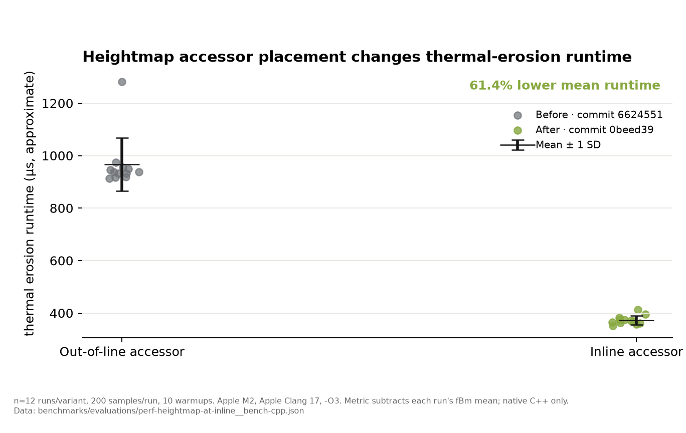
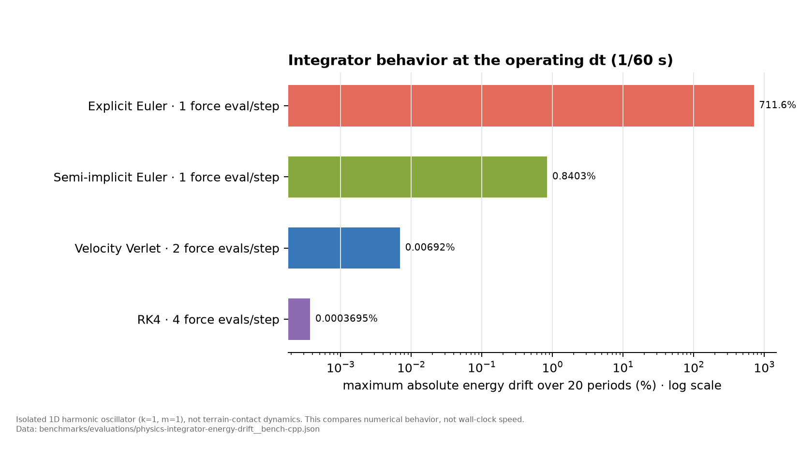

# Phase 2d-2 엔지니어링 증거

이 문서는 Phase 2d-2에서 추가한 C++ correctness/performance 근거 중 외부에 공개 가능한 자료를 요약한다. 원시 결과와 그래프는 모두 저장소의 스크립트로 재생성할 수 있다.

## 측정 환경

| 항목 | 값 |
|---|---|
| Machine | MacBook Air |
| Chip | Apple M2, 8-core CPU (4P + 4E) |
| Memory | 8 GB |
| Architecture | arm64 |
| OS | macOS 26.5.1 (25F80) |
| Compiler | Apple Clang 17.0.0 |
| Flags | `-std=c++20 -O3 -DNDEBUG -Wall -Wextra` |
| Candidate commit | `0beed399724a80dcd90dcfe56531cc9100c48227` |

시리얼 번호나 장치 UUID 같은 개인 식별 정보는 기록하지 않는다.

## 1. Accessor 경계와 thermal-erosion 실행 시간

`Heightmap::at()`의 계산 의미는 바꾸지 않고 정의 위치만 `.cpp`에서 header로 옮겨 호출 지점에서 인라인 가능하게 했다. 두 커밋을 동일 옵션으로 별도 컴파일한 뒤 AB/BA 순서를 번갈아 12회씩 실행했다.

| 지표 | 변경 전 | 변경 후 | 변화 |
|---|---:|---:|---:|
| Thermal erosion only (approx.) | 966.5 ± 101.0 µs | 372.9 ± 17.0 µs | 평균 61.4% 감소 |
| fBm + thermal erosion (direct) | 2962.5 ± 121.3 µs | 2369.0 ± 37.7 µs | 평균 20.0% 감소 |

- raw: [`perf-heightmap-at-inline__bench-cpp.json`](../benchmarks/evaluations/perf-heightmap-at-inline__bench-cpp.json)
- experiment: [`perf-heightmap-at-inline.md`](../benchmarks/experiments/perf-heightmap-at-inline.md)

## 2. 적분기 선택의 수치적 trade-off

운영 `dt=1/60 s`에서 1D 조화진동자를 20주기 적분했다. 이는 terrain-contact dynamics가 아니라 적분기의 장기 수치 거동을 분리해서 보는 모델이다.

| 적분기 | Force evaluations / step | 최대 절대 에너지 drift |
|---|---:|---:|
| Explicit Euler | 1 | 711.6% |
| Semi-implicit Euler | 1 | 0.8403% |
| Velocity Verlet | 2 | 0.00692% |
| RK4 | 4 | 0.0003695% |

이 결과는 semi-implicit Euler가 explicit Euler와 같은 force-evaluation 횟수로 발산을 피한다는 선택 근거다. Verlet/RK4의 더 작은 drift가 실제 terrain workload에서 2~4배 force evaluation을 정당화하는지는 별도 질문이다.

## 3. Correctness 판단표

현재 native C++ suite는 candidate commit에서 16/16 통과했다. 실행 로그는 [`cpp-correctness-suite__ctest.txt`](../benchmarks/evaluations/cpp-correctness-suite__ctest.txt)에 보존한다.

| 질문 | 확보한 증거 | 현재 판단 |
|---|---|---|
| 고속 물체가 지형을 통과할 수 있는가? | 재현/대조 regression test | 구조적 가능성은 확인. 현재 생성 지형 범위에서는 미발동하여 알고리즘 변경 보류 |
| 경계 밖 sampling이 내부 보간을 오염시키는가? | 경계·fractional-coordinate regression test | height와 gradient 경계를 분리해 수정하고 회귀를 고정 |
| worker pool에 data race가 있는가? | Linux/GCC ThreadSanitizer CI | 현재 대상 경로에서 race 미검출. 전체 프로그램 무결성의 일반 증명은 아님 |
| semi-implicit Euler 선택이 합리적인가? | 격리된 oscillator dt sweep | 낮은 force-evaluation 비용에서 발산을 피함. terrain contact 정확도는 별도 검증 필요 |

## 포트폴리오 사용 원칙

- 메인 페이지: 직접 측정한 combined runtime 20.0% 감소를 주 수치로 사용한다.
- 상세 페이지: thermal-only 파생치, 분산, 하드웨어, compiler flags, 한계를 함께 공개한다.
- 적분기 plot은 상세 페이지에만 사용하고 실제 terrain-contact 정확도처럼 표현하지 않는다.
- Python/PPO와 Unity는 C++ core 위의 evaluation/visualization 계층으로만 설명한다.
